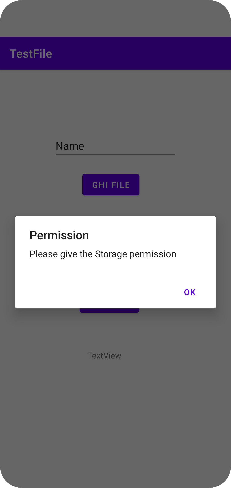
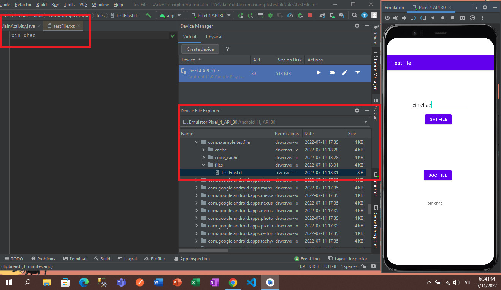

## How to Read,Write File to /from storage in android 11+ and below
In this repo, I am going to show how to get Storage Permission In adnroid 11 and above version
### Note: Add these lines of code in AndroidManifest.xml
```java
    <uses-permission
        android:name="android.permission.WRITE_EXTERNAL_STORAGE"
        android:maxSdkVersion="29" />
    <uses-permission
        android:name="android.permission.MANAGE_EXTERNAL_STORAGE"
        tools:ignore="ScopedStorage" />
    <uses-permission android:name="android.permission.READ_EXTERNAL_STORAGE" />
```
### Result
1. Get Storage Permission


2. Read,Write File

